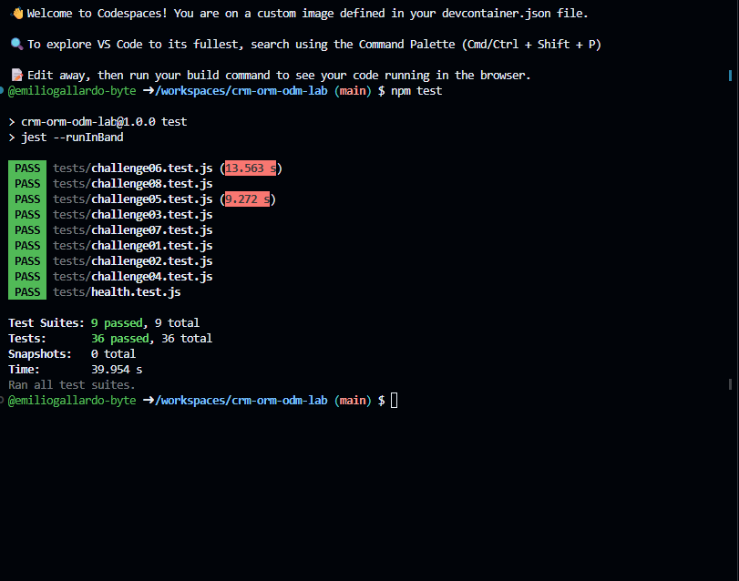

# CRM ORM/ODM Lab

API REST de un CRM básico que combina un ORM (Sequelize + PostgreSQL) y un ODM (Mongoose + MongoDB).

## Stack

- Node.js 22, Express 5, CommonJS
- Sequelize + PostgreSQL 16 (`User`, `Company`, `Contact`)
- Mongoose + MongoDB 7 (`Activity`)
- Jest + Supertest
- GitHub Codespaces, Dev Containers, Docker Compose
- Supervisor (`npm run dev`)

## Arquitectura

```text
GitHub Codespace
│
├── app       Node.js 22  ──┬── Sequelize ──> postgres (PostgreSQL)
│                           └── Mongoose  ──> mongo    (MongoDB)
├── postgres
└── mongo
```

La aplicación se conecta por nombre de servicio (`postgres`, `mongo`). Las credenciales de desarrollo llegan como variables de entorno definidas en `.devcontainer/docker-compose.yml` (ver `.env.example`).

## Iniciar el Codespace

1. En GitHub: **Code → Codespaces → Create codespace on main**.
2. Espera a que se levanten los tres servicios (`app`, `postgres`, `mongo`). `postCreateCommand` ejecuta `npm install`.

## Instalar dependencias

```bash
npm install
```

## Seed y reset

```bash
npm run seed    # inserta datos deterministas (3 users, 4 companies, 8 contacts, 10 activities)
npm run reset   # elimina y recrea tablas/base de datos y vuelve a sembrar
```

## Iniciar la API

```bash
npm start       # node ./bin/www
npm run dev     # supervisor ./bin/www
```

Servidor en el puerto `3000` (variable `PORT`).

## Pruebas

```bash
npm test
```

Cada suite restablece PostgreSQL y MongoDB antes de ejecutarse y cierra las conexiones al terminar.

## Endpoints

| Método | Ruta | Descripción |
|---|---|---|
| GET | `/health` | Health check |
| GET | `/users` | Listar usuarios |
| GET | `/users/:id` | Obtener usuario |
| POST | `/users` | Crear usuario |
| PUT | `/users/:id` | Actualizar usuario |
| DELETE | `/users/:id` | Eliminar usuario |
| GET | `/companies` | Listar compañías (`?industry=`) |
| GET | `/companies/:id` | Obtener compañía |
| POST | `/companies` | Crear compañía |
| PUT | `/companies/:id` | Actualizar compañía |
| DELETE | `/companies/:id` | Eliminar compañía |
| GET | `/contacts` | Listar contactos |
| GET | `/contacts/:id` | Obtener contacto |
| POST | `/contacts` | Crear contacto |
| PUT | `/contacts/:id` | Actualizar contacto |
| DELETE | `/contacts/:id` | Eliminar contacto |
| GET | `/activities` | Listar actividades (`?type=`) |
| GET | `/activities/:id` | Obtener actividad |
| POST | `/activities` | Crear actividad |
| PUT | `/activities/:id` | Actualizar actividad |
| DELETE | `/activities/:id` | Eliminar actividad |

Los errores se devuelven como JSON: `{ "error": "Contact not found" }`.

## Respuestas

**1. Dos motores.**  
Activity funciona bien en MongoDB porque su `metadata` puede cambiar según el tipo. Company y Contact van bien en PostgreSQL porque tienen una relación entre ellas mediante `companyId`.

**2. ORM vs ODM.**  
Un ORM sirve para trabajar con bases relacionales usando modelos y objetos. En este proyecto se usa Sequelize. Un ODM hace algo parecido pero con documentos de MongoDB, usando Mongoose.

**3. Configuración por variables de entorno.**  
Las variables están en `.devcontainer/docker-compose.yml` y en `.env.example`. No conviene poner las credenciales en los archivos `.js` porque quedarían expuestas. La app usa `postgres` y `mongo` porque son los nombres de los servicios de Docker.

**4. Asociaciones.**  
En `models/sequelize/index.js`, una Company puede tener muchos Contact. La llave foránea es `companyId` y está en Contact. El alias `contacts` sirve para identificar esa relación cuando se usa `include`.

**5. Eager loading.**  
Se podría traer primero la compañía y después hacer otra consulta para los contactos. Con `include` se pueden traer juntos, y para este caso es más práctico porque la respuesta ya incluye `contacts`.

**6. Instancia vs consulta.**  
Con la instancia primero busco el contacto y después hago `contact.update()`, por lo que puedo devolver ese mismo registro actualizado. Con `Model.update()` se modifica usando un `where` y la respuesta no está enfocada en devolver la instancia completa.

**7. Esquema flexible.**  
En `models/mongoose/activity.js`, `metadata` usa `Schema.Types.Mixed`. Por eso puede guardar diferentes estructuras para CALL, EMAIL y MEETING. La desventaja es que hay menos validación específica.

**8. Sin ref.**  
`contactId` y `userId` son números que corresponden a registros de PostgreSQL y no tienen `ref` en Mongoose. Por eso no se puede usar `populate`. Si se borra un usuario en PostgreSQL, MongoDB podría conservar ese `userId`.

**9. Documento actualizado.**  
Antes, `findByIdAndUpdate()` devolvía el documento anterior. En `controllers/activities.js` se agregó `new: true` para devolver el nuevo documento y `runValidators: true` para validar los datos.

**10. Pruebas de comportamiento.**  
Así se comprueba lo que realmente hace la API sin depender de una función interna. Mientras la respuesta sea correcta, se puede cambiar la forma de hacerlo.

**11. Repetibilidad.**  
En `tests/setup.js` se conectan las bases y se ejecuta `reset()` antes de cada suite. Al final se cierran las conexiones. Así cada prueba empieza con los mismos datos.

**12. Tu experiencia.**  
El Reto 08 fue de los que más tuve que revisar porque el cambio sí se hacía, pero la respuesta mostraba el valor anterior. Al revisar el controlador y las pruebas, vi que faltaba usar `new: true` y validar la actualización.

## Evidencia

La captura de la terminal está incluida en esta sección y muestra la ejecución de:

```bash
npm test
```

Debe verse la línea:

`Test Suites: 9 passed, 9 total`


